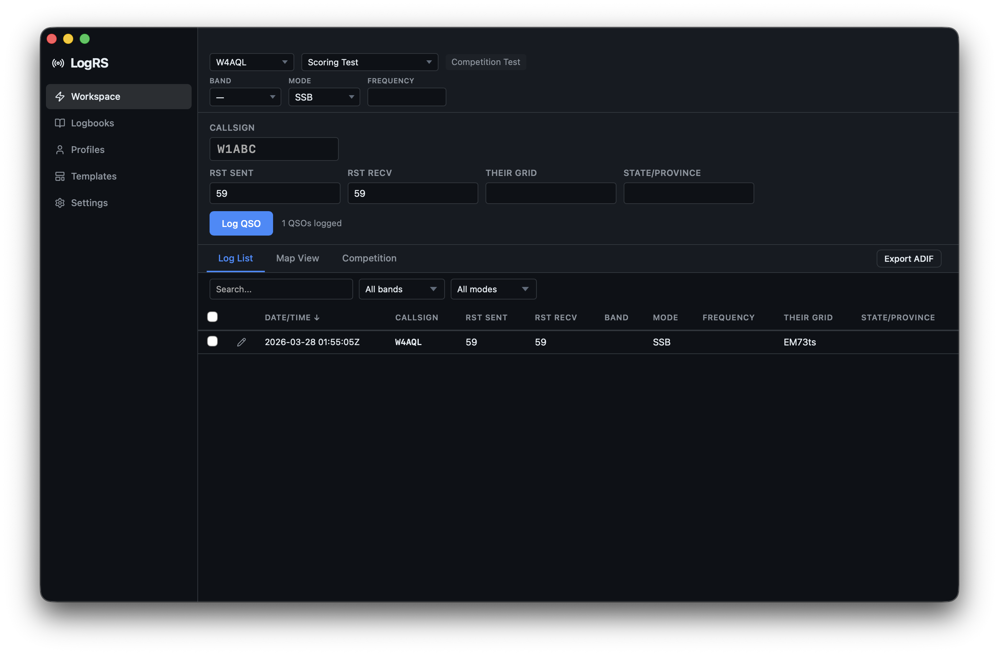

# LogRS

A desktop amateur radio logging application built with Tauri, Solid.js, and Rust.



## Features

- **QSO Logging** — Log contacts with callsign lookup (via HamDB), duplicate detection, and customizable fields per logbook template
- **Templates** — Create custom field layouts with support for text, numeric, dropdown, and lookup field types; station fields persist across QSOs while contact fields reset each entry
- **Competition / Contest Mode** — Template-driven scoring engine with built-in presets (WAS, CQ Zones, etc.) and a live score/multiplier panel
- **POTA & SOTA Support** — Built-in reference data (parks and summits) synced from official sources; autocomplete when logging activations or chaser contacts
- **Map View** — Leaflet map embedded in the workspace showing worked stations plotted from Maidenhead grid squares
- **ADIF Import / Export** — Import existing logs or export for upload to Logbook of the World (LoTW), QRZ, eQSL, etc.
- **Multiple Profiles & Logbooks** — Manage separate operator profiles (callsign, grid, power, etc.) and independent logbooks, each bound to its own template
- **Light / Dark Theme** — System-aware with a manual toggle

---

## Tech Stack

| Layer | Technology |
|---|---|
| UI | Solid.js + TypeScript |
| Desktop | Tauri 2.0 (Rust) |
| Database | SQLite (via rusqlite, WAL mode) |
| Build | Vite 6 + Cargo |
| Maps | Leaflet + OpenStreetMap |
| Linting | Biome (TS), rustfmt (Rust) |

---

## Prerequisites

- [Rust](https://rustup.rs/) (stable)
- [Node.js](https://nodejs.org/) 18+ or [Bun](https://bun.sh/)
- Tauri system dependencies for your OS — see the [Tauri prerequisites guide](https://tauri.app/start/prerequisites/)

---

## Getting Started

### Install dependencies

```bash
bun install
# or: npm install
```

### Run in development

```bash
bun tauri dev
# or: npm run tauri dev
```

This starts the Vite dev server and the native Tauri window together with hot-reload.

### Build for production

```bash
bun tauri build
# or: npm run tauri build
```

The installer/bundle is placed in `src-tauri/target/release/bundle/`.

---

## Development Commands

| Command | Description |
|---|---|
| `bun tauri dev` | Start dev build with hot-reload |
| `bun tauri build` | Create production bundle |
| `bun run format` | Format TypeScript with Biome |
| `bun run lint` | Lint TypeScript with Biome |
| `bun run format:rust` | Format Rust with rustfmt |

---

## Reference Data Sync

POTA and SOTA reference data are fetched from their official APIs and stored locally in SQLite. The app checks for stale data (older than 7 days) automatically 5 seconds after launch and re-syncs in the background. You can also trigger a manual sync from the **Settings** page.

Progress is streamed to the UI via Tauri events (`sync-progress`, `background-sync-started`, `background-sync-completed`).

---

## ADIF

Use the **Logbooks** page to import an existing `.adi` / `.adif` file into a logbook, or to export the current logbook for upload to external services. The exporter maps internal field names to standard ADIF tags.

---

## License

MIT
